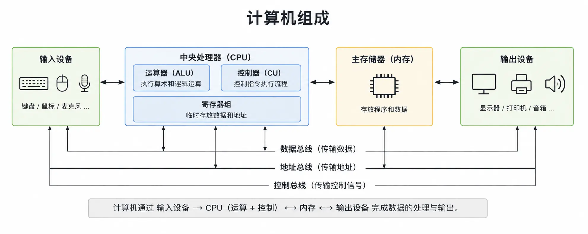

# 第二章 计算机的组成[^1]

<!-- ::: tip
本章以理论为主，不需要编程基础。
::: -->

第一章我们讲了计算机是怎么来的。从帕斯卡的齿轮到 ENIAC 的电子管，再到今天的微处理器，计算机走了一条很长的路。这一章，我们来看看一台计算机到底由哪些部分组成。

## 2.1 冯·诺依曼结构

第一章 1.2 节提到，冯·诺依曼在一份 101 页的报告里，为计算机设计了一套沿用至今的结构。这套结构把计算机分成了五个部分：

- **运算器**：负责计算
- **控制器**：负责指挥
- **存储器**：负责存放程序和数据
- **输入设备**：负责把外面的信息送进来
- **输出设备**：负责把结果送出去

这五个部分各司其职，合在一起就能完成计算。这个模型叫**冯·诺依曼结构**，它是理解计算机怎么工作的起点。

图 2-1 计算机组成示意图

[^2]

不过，先说清楚一件事：**今天的计算机并不完全按照这个结构来造。** 冯·诺依曼结构更像一张“原始蓝图”，而不是“施工图”。真正的现代计算机在它的基础上做了大量修改和扩展。但如果你不理解这张原始蓝图，就没办法理解后面那些修改。所以我们从它开始讲。

冯·诺依曼结构有两个核心思想。

**第一个是二进制。** 计算机内部所有东西——数字、文字、图片、程序——最终都是一串 0 和 1。为什么是二进制？因为电子元件最容易表达两种状态：有电和没电、高电平和低电平、开和关。用两种状态来表示信息，比用十种状态简单得多，也可靠得多。

**第二个是存储程序。** 程序和数据放在同一个存储器里。计算机从存储器里一条一条取出指令，执行，再取下一条。这个概念在 1945 年提出的时候，是一个革命性的想法——在此之前，改变计算任务意味着重新接一遍线路。有了存储程序，你只需要换一个程序，机器就能干另一件事。

::: info
冯·诺依曼结构的五个部分，在今天的计算机里仍然能找到对应。运算器和控制器被集成在 CPU 里，存储器分成了内存和外存，输入输出设备就是你每天在用的键盘、鼠标、显示器和硬盘。只是它们的实现方式，和最初的设计已经差得很远了。
:::

## 2.2 CPU：运算器与控制器

冯·诺依曼结构里的运算器和控制器，在今天被合并成了一块芯片——**中央处理器（CPU）**。

运算器又叫**算术逻辑单元（ALU）**，它只做两件事：算数和判断。算数就是加减乘除，判断就是比较两个数的大小、判断是否相等。你在程序里写的每一个计算、每一个条件判断，最后都要落到 ALU 里执行。

控制器是 CPU 的另一半。它不直接参与计算，而是负责“指挥”。它从存储器里取出指令，翻译成 CPU 能理解的操作，然后告诉运算器、存储器、输入输出设备什么时候该干什么。

你可以把 CPU 想象成一个工厂。运算器是车间，负责干活；控制器是调度室，负责派活。光有车间没人派活，车间就闲着；光有调度室没人干活，调度室下再多命令也没用。两者合在一起，工厂才能运转。

CPU 内部有一个东西叫**时钟**，它每秒发出几十亿次脉冲。每一次脉冲，CPU 就完成一小步操作。时钟的频率越高，CPU 每秒能完成的操作就越多。这就是为什么 CPU 的主频从早期的几兆赫兹涨到了今天的几千兆赫兹。

::: info
CPU 在执行指令的时候，大致要经过几个步骤：取指令、译码、执行、写回。现代 CPU 把这些步骤重叠起来做，叫做“流水线”。第一条指令还在执行的时候，第二条已经在译码，第三条已经在取了。这个思路和工厂的流水线是一回事。
:::

## 2.3 存储器：内存与外存

存储器是计算机存放程序和数据的地方。它分两大类：**主存储器**和**辅助存储器**。

主存储器就是你常听说的**内存**。它的特点是快，但容量小，而且断电就丢数据。你在电脑上打开一个程序，程序会先从硬盘加载到内存里，然后 CPU 从内存里取指令和数据来执行。内存是 CPU 的“工作台”，东西都摊在上面，随手就能拿到。

辅助存储器就是**硬盘**。它的特点是容量大、断电不丢数据，但速度比内存慢得多。硬盘是仓库，东西存在里面，需要的时候搬到工作台上。

为什么不能只用硬盘？因为 CPU 太快了，硬盘太慢了。CPU 从内存取数据需要几十纳秒，从硬盘取数据需要几毫秒——差了十万倍。如果 CPU 每次都去硬盘取数据，它大部分时间都在等。所以必须先把要用的东西搬到内存里，CPU 才能跑得快。

::: info
现代计算机在 CPU 和内存之间还加了一层或几层**缓存（Cache）**。缓存比内存更快，但更小，存放 CPU 最常用的数据。CPU 取数据的时候，先看缓存在不在，不在再看内存，再不在才去硬盘找。这是一个从快到慢、从小到大逐级查找的过程。
:::

## 2.4 输入设备

输入设备把外面的信息送进计算机。最常见的输入设备是键盘和鼠标，你通过它们告诉计算机你想做什么。

但输入设备远不止这两种。麦克风是输入设备，它把声音送进去；摄像头是输入设备，它把画面送进去；触摸屏既是输入设备也是输出设备，你点它的时候它在接收输入，它显示画面的时候在输出。

回到我们在序言里给计算机下的那个宽定义——洗衣机的按钮是输入设备，你按下它，洗衣机才知道你要洗衣服；智能门锁的指纹传感器是输入设备，它把你的指纹读进去，交给芯片去比对。

## 2.5 输出设备

输出设备把计算机处理的结果送出来。最常见的输出设备是显示器和打印机。显示器把画面展示给你，打印机把文字印在纸上。

音箱是输出设备，它把声音放出来；振动马达是输出设备，手机静音的时候靠它提醒你有消息；洗衣机的指示灯是输出设备，它告诉你还有多久洗完；智能门锁的蜂鸣器是输出设备，它“嘀”一声告诉你门开了。

输入和输出有时候是同一套硬件。触摸屏既接收你的点击，又显示画面。网卡既发送数据，又接收数据。它们既是输入设备，也是输出设备。

## 2.6 总线：把它们连起来

五个部件不是孤立的，它们需要互相通信。CPU 要从内存取指令，要把结果写到内存，要从输入设备读数据，要往输出设备发数据。这些通信都通过**总线**来完成。

总线是一组公共的导线，所有部件都挂在上面。同一时刻，总线上只能有一个部件在发送数据，但可以有多个部件在接收。谁先发、谁后发、发给谁，由控制器协调。

你可以把总线想象成一条公路。CPU、内存、输入输出设备是公路边上的房子。数据是公路上跑的车。房子之间要传东西，车就得从公路上走。公路只有一条，车多了就会堵，这就是为什么总线的速度也会影响计算机的整体性能。

::: info
到这里，你已经知道了计算机由哪五部分组成，以及它们各自负责什么。冯·诺依曼结构是一个经典的起点，但现代计算机在这条路上走了很远。下一章，我们将看看数据在计算机里到底是怎么表示的——为什么全是 0 和 1，以及这串 0 和 1 怎么变成你看到的文字、图片和声音。
:::
[^2]:图片来源于[此](https://www.runoob.com/computer-organization/computer-organization-tutorial.html)
[^1]: 本章内容综合参考了以下资料，部分内容有改动：
    - [知乎专栏：计算机组成原理](https://zhuanlan.zhihu.com/p/554546968)
    - [CSDN：计算机组成原理](https://blog.csdn.net/sunshine_hsm/article/details/81536509)
    - [CSDN：计算机组成详解](https://blog.csdn.net/Chimengmeng/article/details/134509145)
    - [菜鸟教程：计算机组成](https://www.runoob.com/computer-organization/computer-organization-tutorial.html)
    - [百度百科：计算机组成](https://baike.baidu.com/item/%E8%AE%A1%E7%AE%97%E6%9C%BA%E7%BB%84%E6%88%90/9237940)